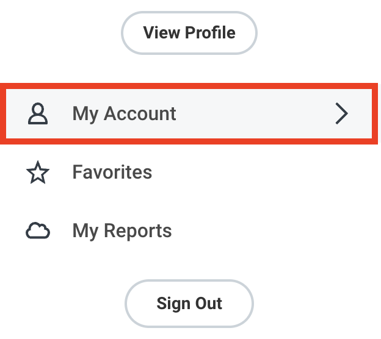
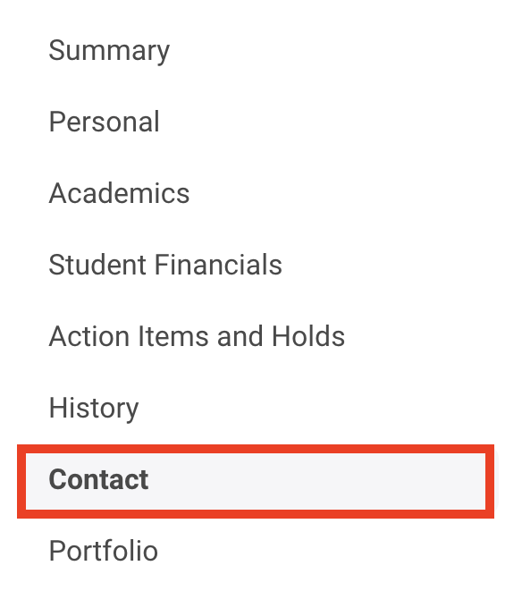
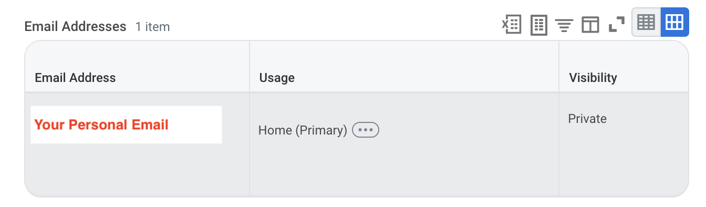
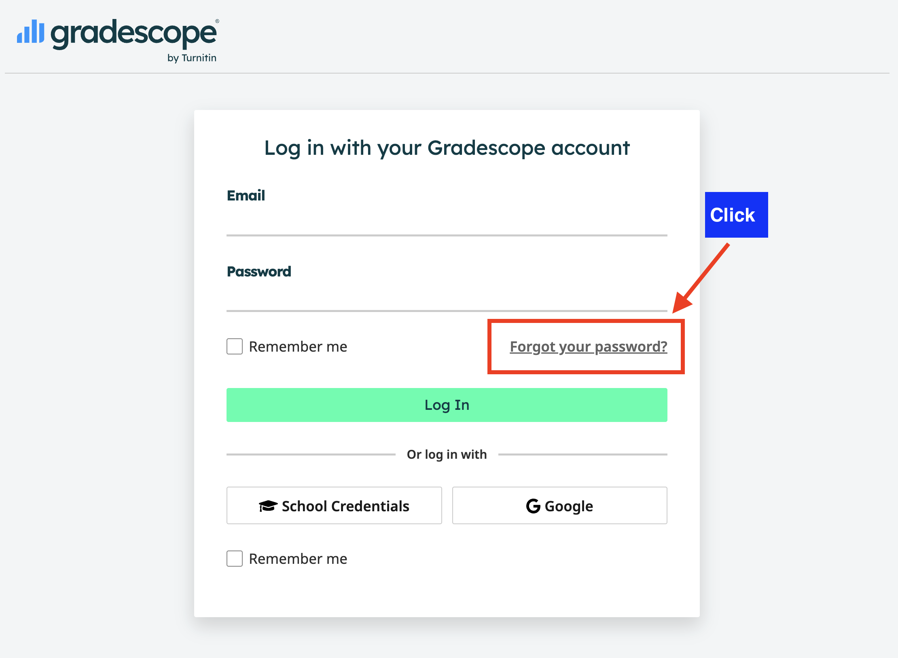
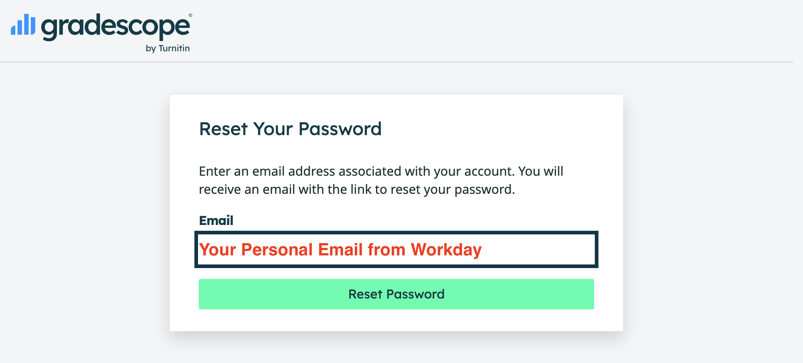
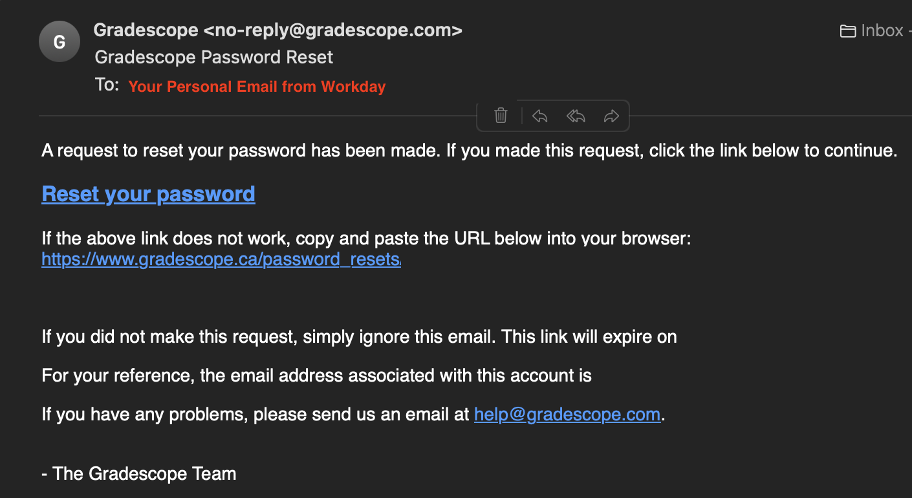

# Accessing Gradescope

Use the email address listed in Workday to create or reset your Gradescope password. This is the email address Gradescope expects for your course account.

## 1. Find Your Email Address in Workday

First, sign in to Workday and open your account menu. Select **My Account**.

In your account profile, select **Contact**.

Under **Email Addresses**, find the email address listed for your account. Use this exact email address when resetting your Gradescope password.

## 2. Reset Your Gradescope Password

Go to [Gradescope Canada](https://www.gradescope.ca) and select **Forgot your password?** on the login page.

Enter the same email address you found in Workday, then select **Reset Password**.

## 3. Open the Password Reset Email

Check the inbox for the email address you entered. You should receive a message from Gradescope with a **Reset your password** link.

Open the link in the email and follow the instructions to create a new password. After that, return to [Gradescope Canada](https://www.gradescope.ca) and log in using your Workday email address and new Gradescope password.

## Troubleshooting

- Make sure you enter the exact email address shown in Workday.
- Check your junk or spam folder if the password reset email does not arrive.
- If you have multiple email accounts, check the inbox for the Workday email address you used.
- If you still cannot access Gradescope, contact the teaching team on Slack.
