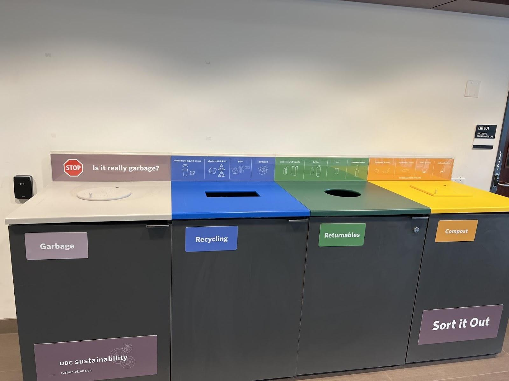
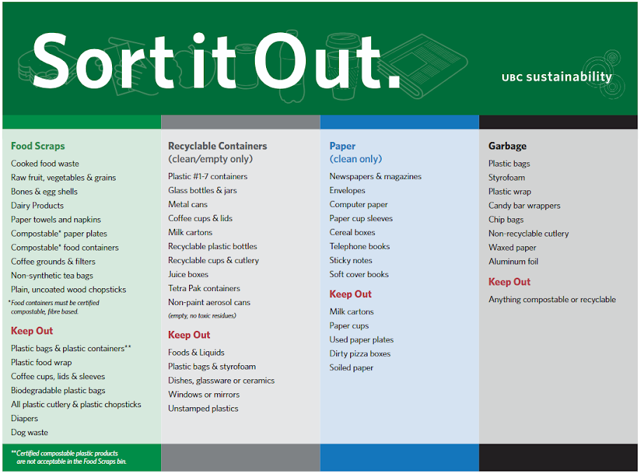

# Project Milestone 1: Problem Statement Pitch

> [!NOTE]
> This milestone is still in development and subject to change as rubrics and templates are finalized. The information below is meant to give you a general sense of what this milestone will be about, but please check back for updates. This banner will be removed once the milestone description is finalized.

## Changelog

- June 3: Added the project M1 rubric.
- May 28: Added project M1 [template link](#accessing-the-project-template) and instructions for accessing it.
- May 24: Updated page readability and added policy reminders.
- May 13: Added TCPS Ethics Certification prerequisite notice.
- May 11: Initial version of milestone description and deliverable requirements.

## Overview

In this milestone, your team will pitch a **human need, design problem, or design opportunity** that you think is worth investigating for your course project.

> [!WARNING]
> Each student must complete and submit the [TCPS Ethics Certification](project/ethics-certification.md) before participating in any Milestone 1 or other course project work.

The goal is not to design a solution yet. Instead, your job is to explain:

- what need, problem, or opportunity your team has noticed
- who is affected by it
- where and when it happens
- why existing designs do not fully address it
- how your team plans to investigate it further

Think of this as a pitch for the **problem and investigation plan**, not a pitch for the final interface.

By the end of this milestone, your team should have a clearer direction for the next stage of the project, where you will move from an initial problem idea toward evidence-based design requirements.

## Learning Objectives

After completing this milestone, you should be able to:

- Describe a human need, design problem, or design opportunity in relation to specific stakeholders and a specific context.
- Identify existing reference designs that already attempt to address part of the need.
- Critique reference designs by identifying what they support well and where they fall short.
- Translate your critique into early design considerations that may guide later investigation.
- Create research questions for a need-finding study.
- Select appropriate HCI methods, such as observation, interview, or questionnaire, to investigate the need further.
- Communicate a project direction clearly and persuasively as a team.

### Peer Evaluation 

This milestones include a **PRACTICE** peer evaluation component. Each team member will evaluate their teammates’ contributions to the project using a structured peer evaluation form, however, this will not impact your grade for this milestone. 

The purpose of this practice peer evaluation is to help you reflect on your teamwork and communication, and to prepare you for the peer evaluations that will be part of later milestones.

Refer to the [peer evaluation information page](project-peer-evaluation.md) and [group work resources](group-work-resources.md) for details.

## What You Are Pitching

You are pitching a problem space that your team believes is worth investigating.

A strong pitch should help your audience understand:

- what is happening now
- why the current situation is not ideal
- who is affected
- why existing designs are insufficient
- what your team still needs to learn before proposing a solution

You are **not** expected to design the solution yet. Avoid making your presentation mainly about an app, website, product, or prototype you already want to build. You may have early ideas, but they should not be the focus of this milestone.

## Scope Check

Your project idea should be scoped so that it could plausibly lead to a human-computer interface design project during this course.

A good project direction is usually:

- specific enough that your team can investigate it during the term
- connected to real people, activities, and contexts
- possible to explore using HCI methods
- likely to lead to an interface, tool, workflow, app, website, interactive artifact, or similar design outcome

<strong>Scope Examples</strong>

**Good scope**

Examples of appropriately scoped project directions:

- Helping students in residence sort waste correctly when they are unsure which bin to use.
- Helping first-year students decide which bus route to take when commuting to campus during busy times.
- Helping students coordinate shared responsibilities in a group project without relying only on scattered messages.
- Helping teaching assistants keep track of recurring grading concerns while giving feedback to many students.
- Helping gym users understand whether equipment is available before walking across campus.

**Too broad**

These are likely too broad for this course project:

- Fix public transportation.
- Improve sustainability at UBC.
- Solve student mental health.
- Make education more fair.
- Redesign healthcare.

These topics may contain useful project ideas, but they need to be narrowed to a specific stakeholder group, context, and interaction.

**Too narrow**

These are likely too narrow for this course project:

- Make a button bigger.
- Change the colour of an icon.
- Add a dropdown menu to an existing page.
- Create one reminder notification.
- Redesign one login screen.

These may be design changes, but they are not yet a full design problem.

**Hard to access**

Some topics may be difficult because your team cannot realistically investigate the people or context involved.

For example, “redesigning emergency-room triage for nurses and physicians” may be interesting, but it is not a good choice unless your team has realistic access to that setting and stakeholder group.

Choose a problem space where you can reasonably learn from the context during the course.

## Light Preliminary Evidence

You are not required to conduct a formal study before this pitch.

However, your pitch will be stronger if you can point to light preliminary evidence that helped your team notice the problem. This could include:

- screenshots of existing designs
- photos of physical interfaces or signs
- public documentation
- informal observations
- examples from your own experience
- app reviews or public user complaints
- visible inconsistencies across existing systems

This evidence should support your reasoning, not replace the need-finding study you are planning.

## Deliverable

Your team will submit and present a slide deck.

Your presentation should be **no more than 15 minutes**. Any remaining time will be used for peer, TA, and teaching team feedback.

All team members must speak during the presentation. The presentation should feel coordinated, not like separate unrelated sections placed beside each other.

Because this is an in-person project milestone, all group members are expected to attend and participate in person.

## Presentation Expectations

Your presentation should be clear, focused, and easy to follow.

As a team, make sure you:

- stay within the 15-minute limit
- explain the problem before discussing possible methods
- use visuals where they help the audience understand the context or reference designs
- avoid dense slides with too much text
- make clear transitions between speakers
- ensure every team member speaks
- leave the audience understanding why this problem is worth investigating

For practical guidance on team roles, meeting expectations, and coordination routines, see the [Group Work Resources](group-work-resources.md).

## Submission

Refer to the [course submission information page](course-submission-info.md) for the latest information on how to submit items for the course.

> [!IMPORTANT]
> This milestone is an in-person presentation milestone. Review [Workshop Attendance & Participation](syllabus.md#workshop-attendance--participation), [Course Submission Info](course-submission-info.md), the [CPSC 344 Artificial Intelligence Use Policy](ai-policy.md), and the [Milestone 1 practice peer evaluation](project-peer-evaluation.md#milestone-1-practice-peer-evaluation) expectations before the deadline.

## Accessing the Project Template

The template is a Google Doc: [M1 Project Template](https://docs.google.com/document/d/1atp1Uw0clNTdo7-r1RNxE2ap8TUI9eaevMz3VRRbXKs/edit?tab=t.0#heading=h.bx9ltwnuavx4). Your team is expected to select **File → Make a copy** and work from your own copy.

## Running Example:

### Slide 1: Human Need, Design Problem, or Design Opportunity

<strong>Running example: Slide 1</strong>

**Need statement:** A design that helps waste get sorted properly in UBC residence.

**Stakeholders:** **UBC students living in residence**, UBC staff involved in waste disposal, people involved in downstream waste management, the environment.

**Context:** Waste sorting in UBC residence buildings.

In this example, students living in residence are bolded because they are likely the primary users who would directly interact with a potential interface.

### Slide 2: Reference Designs

<strong>Running example: Slide 2</strong>

**Reference Design 1:** Labelled waste bins  
These allow different kinds of waste to be placed in different bins so that garbage, recycling, returnables, and compost can be processed separately.

**Reference Design 2:** Waste sorting poster or guide  
This provides more detailed information about what items belong in each bin.

### Slides 3 and 4: Critique Reference Designs

<strong>Running example: Slides 3 and 4</strong>

**Reference Design:** Labelled waste bins

**Early Design Consideration 1: Visual Clarity**  
A design should make the user’s required action clear without relying on too much reading.  
The labelled bins partially support this because colours and icons may help users quickly identify categories, but some labels and graphics may still be confusing.

**Early Design Consideration 2: Time per Item**  
A design should help users decide where an item goes quickly, especially when they are in a rush.  
The labelled bins partially support this, but users may still need to stop and read detailed signage before choosing the correct bin.

**Early Design Consideration 3: Error Protection**  
A design should help prevent users from placing items in the wrong bin or help them notice mistakes.  
The labelled bins do not strongly support this because users can put almost any item into almost any bin if it fits.

### Slide 5: Need-Finding Research Questions

<strong>Running example: Slide 5</strong>

For the waste sorting example, possible research questions include:

1. How often do students in residence feel uncertain about which bin to use?
2. What kinds of items are most confusing for students to sort?
3. What parts of the current waste sorting setup help or prevent students from sorting correctly?

### Slide 6: Need-Finding Methods

<strong>Running example: Slide 6</strong>

**Method 1: Observation**  
We would observe how students interact with the waste sorting area in a residence building.  
This method is useful because it lets us see what people actually do in context, rather than only asking what they think they do.

**Method 2: Interview**  
We would interview students living in residence about moments when they felt unsure about waste sorting.  
This method is useful because it helps us understand the reasoning, confusion, and assumptions behind students’ actions.

### Slide 7: Research Question and Method Table

<strong>Running example: Slide 7</strong>

|                        Research Question                         |                                Observation                                |                                       Interview                                       |
| :--------------------------------------------------------------: | :-----------------------------------------------------------------------: | :-----------------------------------------------------------------------------------: |
|   How often do students feel uncertain about which bin to use?   |    Count hesitation, checking signs, switching bins, or asking others.    |            Ask students to describe recent moments when they were unsure.             |
|         What kinds of items are most confusing to sort?          |         Record which items seem to cause hesitation or mistakes.          |                 Ask students which items they find difficult and why.                 |
| What parts of the current setup help or prevent correct sorting? | Note signage, bin placement, openings, labels, and environmental factors. | Ask students what they notice, ignore, trust, or find confusing in the current setup. |

## Rubric

<strong>Exceeds Expectations (5 points)</strong>

**1. Frame the Need, Stakeholders, & Context (20 points)**  
The human need is specific, convincing, scoped for a term project, and design-independent. All relevant stakeholders are clearly identified and justified, with the primary stakeholders indicated. The context is specific enough to scope an investigation.

**2. Critique of Reference Designs (20 points)**  
Both reference designs are distinct, clearly described and critiqued, and highly relevant to the need. Three design considerations per design are identified with succinct labels. Each consideration explains clearly how the design succeeds or falls short. At least two of the three considerations per design go beyond simple visual changes.

**3. Need-Finding Research Questions (25 points)**  
Three research questions are relevant to the need, distinct, and directly informed by the reference design critiques. They are diverse in scope (open-ended and specific) and scoped to pre-design discovery, meaning each question targets stakeholder behaviours, contexts, and pain-points, not solution opinions.

**4. Plan Need-Finding Methods (25 points)**  
Two methods (observation, interview, questionnaire) are concisely described and are appropriate for the research questions. Justification explains specifically why each method yields the right data and how the methods complement each other for this problem. The method-research question table is complete and shows a clear, logical link to specific data.

**5. Presentation & Team Coordination (10 points)**  
The presentation is within the time limit. Slides are clear, uncluttered, and use visuals effectively. It follows all template instructions, e.g., required length, conciseness when applicable, presented with visuals, etc. All members speak with equitable time. The team coordinates well to produce a strong presentation and Q&A (e.g., have practiced, seamless transitions, function as a single, unified pitch, etc.).

<strong>Meets Expectations (3 points)</strong>

**1. Frame the Need, Stakeholders, & Context (12 points)**  
There are minor problems in only one of the following cases: 1) The human need is clear, appropriately scoped, but not entirely design-independent (i.e., it hints at a solution). 2) Stakeholders are mostly identified and justified, with primary stakeholders correctly recognized, but is missing a crucial non-primary stakeholder. 3) The context is described but is either not specific enough or overly specific for this investigation.

**2. Critique of Reference Designs (12 points)**  
There are minor problems in only one of the following cases: 1) Two reference designs presented, but they are not be entirely distinct. 2) One reference design isn't highly relevant to the human need. 3) Three design considerations per design are identified, but at least one and no more than two considerations does not explain how the design succeeds or falls short. 4) Only one consideration in each design go beyond surface-level visual critique.

**3. Need-Finding Research Questions (15 points)**  
There are minor problems in only one of the following cases: 1) Three questions are relevant and connect to the design considerations, but two of them are not entirely distinct. 2) One question is not open-ended or specific. 3) One question is not scoped to pre-design stage.

**4. Plan Need-Finding Methods (15 points)**  
There are minor problems in only one of the following cases: 1) Two appropriate methods are chosen but not clearly described. 2) Justification explains why each is a reasonable choice with connection to the problem but not how they complement each other. 3) The method-question table is mostly complete with a logical relationship, but is missing important information in one cell.

**5. Presentation & Team Coordination (6 points)**  
There are minor problems in only one of the following cases: 1) The presentation is over the time limit by no more than 30 seconds. 2) Slides are mostly organized with appropriate visuals, with some minor distracting features. 3) It misses only one template instructions. 4) The presentation is coordinated and unified, but not all members speak with reasonably distributed time.

<strong>Approaches Expectations (1 point)</strong>

**1. Frame the Need, Stakeholders, & Context (4 points)**  
There are more than one minor problem, or it has a major flaw in one of the following cases that makes the revision difficult: 1) The human need is stated but may lack specificity, clear rationale, or is prescribing a solution. 2) Stakeholders are mentioned but may be incomplete, vague, or poorly justified. The primary stakeholders may be incorrectly identified. 3) The context lacks important details to scope investigation.

**2. Critique of Reference Designs (4 points)**  
There are more than one minor problems, or it has one major flaw in one of the following cases that makes the revision difficult: 1) The two reference designs are highly similar. 2) Only two design considerations per design are identified. 3) Explanations for design considerations or critique of reference designs are vague or superficial. 4) Critique relies entirely on visual observations.

**3. Need-Finding Research Questions (5 points)**  
There are more than one minor problem, or it has a major flaw in only one of the following cases that makes revision difficult: 1) The three research questions are related. 2) The questions do not connect to the design considerations. 3) Two questions are not open-ended or specific. 4) Two questions are not scoped to pre-design stage. 5) Only two suitable research questions are provided.

**4. Plan Need-Finding Methods (5 points)**  
There are more than one minor problem, or it has a major flaw in only one of the following cases that make the revision difficult: 1) Methods are vaguely described or poorly matched to questions. 2) Justification is generic and does not explain why each is suitable. 3) The method-question table is clearly incomplete or show weak links between methods and data.

**5. Presentation & Team Coordination (2 points)**  
There are more than one minor problem, or it has a major flaw in only one of the following cases that makes revision difficult: 1) The presentation is over the time limit by at least 30 seconds but no longer than 2 minutes. 2) Slides are cluttered, text-heavy, or have ineffective visuals. 3) It missed more than one but no more than three template instructions. 4) Speaking time is clearly uneven between members. 5) The presentation and Q&A feel uncoordinated and not unified.

<strong>Not Demonstrated (0 points)</strong>

**1. Frame the Need, Stakeholders, & Context (0 points)**  
There are more than one major flaws, or it meets one or more of the following cases: 1) The human need is missing. 2) Stakeholders are absent and/or not identified. 3) The context is missing.

**2. Critique of Reference Designs (0 points)**  
There are more than one major flaws, or it meets one or more of the following cases: 1) Reference designs are missing, only one provided, or irrelevant. 2) Considerations are absent, unlabelled, or fail to explain success or shortfall. 3) No critique of reference designs provided.

**3. Need-Finding Research Questions (0 points)**  
There are more than one major flaw, or no more than one suitable research question provided.

**4. Plan Need-Finding Methods (0 points)**  
There are more than one major flaw, or it meets one of more of the following cases: 1) Methods are missing, only one provided, or not from the specified set. 2) Descriptions or justifications are absent or irrelevant. 3) The method-question table is absent or illogical.

**5. Presentation & Team Coordination (0 points)**  
There are more than one major flaw, or it meets one or more of the following: 1) The presentation is very significantly over time by more than 2 minutes. 2) Slides are missing, inappropriate, or highly distracting. 3) More than three template instructions are not followed. 4) At least one member does not speak during the presentation. 5) The presentation is clearly unprepared.

