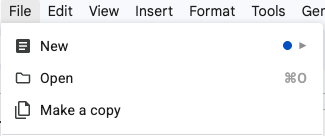

# Project Milestone 3: Shark Tank

## Changelog

- June 17: Added submission template, formatted running example
- May 24: Updated page readability and added policy reminders.
- May 23: Added Design Decision Log requirement.
- May 13: Added TCPS Ethics Certification prerequisite notice.
- May 11: Initial version of milestone description and deliverable requirements.

## Overview

In this milestone, your team will present multiple possible design approaches for your project.

> [!WARNING]
> Each student must complete and submit the [TCPS Ethics Certification](project/ethics-certification.md) before participating in any course project work.

In Project Milestone 2, your team investigated a human need, design problem, or design opportunity and translated your findings into user scenarios, central tasks, design requirements, and metrics. In this milestone, you will use that work to brainstorm and communicate possible design directions.

The goal is not to present a finished product. Instead, your goal is to show that your team can generate distinct design approaches, explain the thinking behind them, and critically evaluate their strengths and weaknesses.

You should imagine that you are pitching early design ideas to an audience that wants to understand the potential of your project. Your audience should leave understanding:

- what problem your team is addressing
- which central tasks your design approaches support
- what design requirements guided your thinking
- what design approaches your team is considering
- what is promising and risky about each approach

This is a pitch, but it is also a critique exercise. Strong teams do not pretend that every idea is perfect. They show that they can think creatively and critically at the same time.

## Learning Objectives

After completing this milestone, you should be able to:

- Brainstorm a variety of design approaches that address a human need, design problem, or design opportunity.
- Create low-fidelity, throwaway prototypes that communicate design ideas clearly.
- Use user scenarios, central tasks, design requirements, and general design principles to critique design approaches.
- Explain the conceptual model behind a design approach.
- Communicate design ideas clearly through an oral presentation.
- Collaborate with group members to deliver a coordinated presentation.
- Critique other teams’ design approaches through constructive feedback.

## What This Milestone Is About

This milestone is about moving from:

> “We have evidence-based design requirements.”

to:

> “We have multiple possible design approaches, and we can explain how each one might address the need.”

Your team should not choose the final design too quickly. The purpose of Shark Tank is to explore alternatives before committing to one direction.

A strong Shark Tank presentation shows:

- more than one possible design direction
- clear connection to the central tasks from Milestone 2
- clear connection to the design requirements from Milestone 2
- low-fidelity sketches or prototypes that make the ideas understandable
- honest reflection on what each approach does well and where it may fall short

## Deliverable

Your team will submit and present a slide deck.

Your presentation should be **10 minutes maximum**, followed by approximately **2 minutes for Q&A**.

All group members are expected to attend and participate in person. Each team member should contribute meaningfully to the presentation.

Because this is an in-person project milestone, absence tokens cannot be used for this session. Refer to the syllabus for the workshop attendance policy and requirements for Shark Tank presentations.

## Submission

Refer to the [course submission information page](course-submission-info.md) for the latest information on how to submit items for the course.

> [!IMPORTANT]
> Shark Tank is an in-person project milestone. Absence tokens cannot be used for this session. Review [Workshop Attendance & Participation](syllabus.md#workshop-attendance--participation), [Course Submission Info](course-submission-info.md), the [CPSC 344 Artificial Intelligence Use Policy](ai-policy.md), and [Group Work Resources](group-work-resources.md) while planning roles and backups.

## Accessing the Project Template

The template is a Google Doc: [M3 Project Template](https://docs.google.com/document/d/1atp1Uw0clNTdo7-r1RNxE2ap8TUI9eaevMz3VRRbXKs/edit?tab=t.0#heading=h.bx9ltwnuavx4](https://docs.google.com/document/d/1-23PQoDUHWpm4BIhlk7vtW3LK9f1DCR-VfrZ5oP6Yts/edit?tab=t.0). Your team is expected to select **File → Make a copy** and work from your own copy.

## Required Slide Structure

Your slide deck should include the sections below.

You may design the slides in a way that best supports your pitch, but the required information must be easy to find and understand.

## Running Example

### Slide 1: Project Context and Central Tasks

<strong>Partial example: project context and central tasks</strong>

**Need:** A design that helps instructors share visuals with students in an online class in real time.

**Central Tasks:**

1. **Display a document:** The instructor needs to show a document clearly during class.
2. **Draw on the document:** The instructor needs to annotate or draw on the document while explaining.

**User Scenario 1:** Samira is a math teacher who usually works through geometry problems on a blackboard. When teaching online, she wants to draw while explaining, but she does not want to spend time learning complex software.

**User Scenario 2:** Alex is a teaching assistant leading an online tutorial. They need to display student-submitted examples, point to specific areas, and make quick annotations while answering questions.

### Slide 2: Design Decision Log

<strong>Partial example: design decision log</strong>

| Decision | What changed? | Why did it change? | Evidence or feedback used |
| :------: | :-----------: | :----------------: | :-----------------------: |
| We prioritized one central task. | We focused our design approaches on helping students identify uncertain items before disposal. | This task appeared more frequently in our need-finding data than our original planning task. | Interview themes and Milestone 2 design requirements. |

### Slide 3: Design Requirements

<strong>Partial example: design requirements</strong>

**Intuitiveness:** The solution should be easy for a first-time user to navigate without confusion or errors.

**Fast Annotation:** The solution should allow instructors to add simple annotations quickly during a live class.

**Visibility:** Students should be able to clearly see the document and annotations during the session.

### Remaining Slides: Design Approaches

## What Counts as a Design Approach?

A design approach is a possible direction for how the interaction could work.

It is more than a single feature, but it does not need to be a complete polished system.

<strong>Examples of design approaches that are too similar</strong>

These are likely too similar:

- A mobile app with a search bar
- A mobile app with a bigger search bar
- A mobile app with a search bar and different colours

These are mostly variations of the same idea.

<strong>Examples of meaningfully distinct design approaches</strong>

These are more meaningfully different:

- A mobile app that guides users through step-by-step decisions
- A physical kiosk located at the point of action
- A browser-based dashboard that helps users plan before arriving
- A conversational interface that helps users ask questions in natural language
- A collaborative whiteboard-style interface that supports live group work

The goal is to explore different interaction models, not just different visual styles.

## Low-Fidelity Sketches and Throwaway Prototypes

Your design approaches should be supported by low-fidelity sketches or throwaway prototypes.

These may include:

- hand-drawn sketches
- simple wireframes
- paper prototypes
- storyboard panels
- interface mockups
- diagrams of interaction flow
- rough clickable prototypes, if helpful

The prototype does not need to be beautiful or complete. It does need to be clear enough that your audience can understand the idea.

A good low-fidelity prototype helps the audience see:

- what the user would interact with
- what the main steps might be
- how the design supports the central task
- how the design differs from your other approaches

## Conceptual Model

For each design approach, briefly explain the conceptual model.

A conceptual model describes how users are expected to understand and interact with the system.

<strong>Common conceptual model examples</strong>

For example, the design might be organized around:

- a checklist
- a map
- a conversation
- a dashboard
- a timeline
- a workspace
- a recommendation system
- a step-by-step wizard
- a shared canvas

Do not only describe what appears on the screen. Explain how the user is supposed to think about the interaction.

<strong>Conceptual model wording example</strong>

Instead of saying:

> This design has buttons, filters, and a results page.

say:

> This design uses a guided decision-tree model. Users answer one question at a time, and the system narrows the options until it recommends an action.

## Critiquing Your Own Design Approaches

For each design approach, include both strengths and weaknesses.

Your critique should be based on:

- your user scenarios
- your central tasks
- your design requirements
- your reference design critique
- general design principles
- what your team learned from Milestone 2

<strong>Critique wording example</strong>

Avoid vague claims such as:

> This design is user-friendly.

Instead, be more specific:

> This design may support first-time users because it breaks the task into small steps, but it may be too slow for users who already know what they want to do.

## Presentation Expectations

Your presentation should be clear, visual, and easy to follow.

As a team, make sure you:

- stay within the 10-minute presentation limit
- clearly explain the project context before presenting design approaches
- show, rather than only describe, your design approaches
- make each design approach visually understandable
- explain how each approach supports central tasks
- connect design decisions to your requirements
- acknowledge weaknesses or trade-offs
- make clear transitions between speakers
- ensure all team members are prepared for Q&A

This presentation should not feel like separate unrelated sections placed beside each other. The team should present a coordinated design exploration.

## Shark Participation

When your team is not presenting, you will help critique other teams’ design approaches as a “shark.”

The goal is not to be harsh. The goal is to give useful design feedback.

For each presentation your team is assigned to respond to, one or more members of your team will act as sharks. Each student must participate as a shark at least once during the Shark Tank session.

As a shark, you may be asked to provide feedback on:

- which design approach you found most promising
- what you liked about that approach
- what questions or concerns you have
- what advice you would give the team as they develop the design further

Good shark feedback is specific, constructive, and connected to the presenting team’s design goals.

<strong>Weak and stronger shark feedback examples</strong>

**Weak feedback**

> I liked the second idea. It was cool.

**Stronger feedback**

> I liked the second idea because the dashboard model seems better suited for users who need to compare multiple options quickly. However, I would be worried about whether first-time users understand which information matters most. You might consider testing whether users can identify the next action within the first few seconds.

