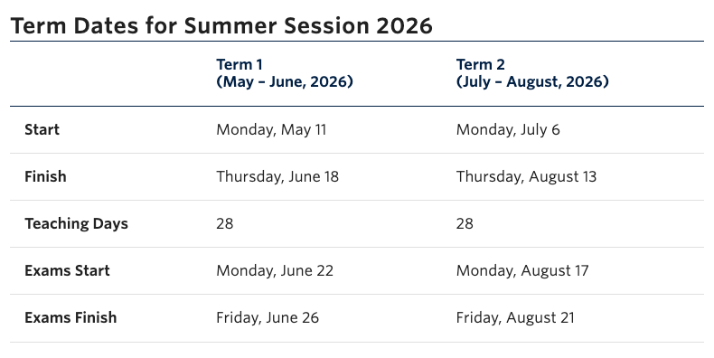
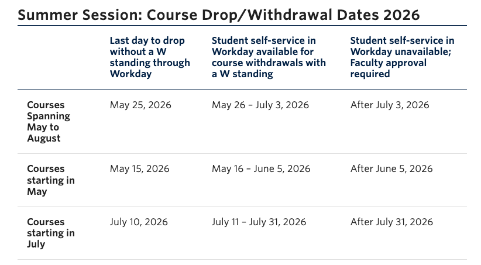

# CPSC 344 - Course Syllabus

Department of Computer Science, University of British Columbia (Vancouver, Point Grey Campus)

**Summer 2026 - CPSC 344 (Section 901) || Introduction to HCI Methods (3)**

## Course Instructor

- Parsa Rajabi
  - Email: *prajabi at cs`DELETEthisTEXT`.ubc.ca*
  - Office Hours: 
    - Mondays; 17:20-18:00 in MCLD 2018/ICCS 255
    - Wednesdays; 16:50-17:30 in MCLD 2018/ICCS 255 
    - or by appointment (email to schedule)

Refer to [course communication conventions](#course-communication-conventions) for the best way to reach out to the instructor.

## Lectures

This is a full summer course spread across 2 summer terms:
- Term 1: May 11 - June 18
  - Midterm Exam: June 17
  - No class between June 22 and July 3 (Term 1 finals and break)
- Term 2: July 6 - August 13
  - Final Exam Period (August 17-21) 

Delivery Method: In-person (*no recordings*)

- Mondays 15:30-17:30 in MCLD 2018
- Wednesdays 15:30-17:00 in MCLD 2018

This course requires significant commitment for both the teaching team and the students. The course is designed to be interactive, with a focus on hands-on learning and practical applications of human-computer interaction concepts. Students are expected to actively engage in **group work outside of class time** and to collaborate with their peers on a semester-long project (entire summer from May through August). **A lighter course load is strongly recommended** to ensure active participation, high-quality work, and the potential to earn a good grade in the course. Students who are working full-time internships/co-ops or have other significant commitments should carefully consider whether they can meet the demands of this course. If in doubt, please reach out to the instructor to discuss.

#### Land Acknowledgement

We acknowledge that the land on which we gather is the traditional, ancestral and unceded territory of the Coast Salish Peoples, including the territories of the xʷməθkʷəy̓əm (Musqueam), Sḵwx̱wú7mesh (Squamish), and səl̓ílwətaɬ (Tsleil-Waututh) Nations.

## Discussions/Workshops

CPSC 344 has multiple "workshops" (listed as Discussions on Workday). These sessions are designed to be hands-on and interactive, where students will work on assignments, projects, and other activities. The workshops are **only conducted in-person**, no recordings will be made available.

| Section |         Time          | Location  | TAs   (tentatively) | Co-working Sessions (in ICCS X360) |
| :-----: | :-------------------: | :-------: | :-----------------: | :--------------------------------: |
|   D0A   | Thursdays 16:00-18:00 | ICCS X360 |       Mike +        |         [Mike] X-Day TIME          |
|   D0B   | Thursdays 18:00-20:00 | ICCS X360 |     Mike + Kris     |         [Mike] X-Day TIME          |
|   D0C   |  Fridays 10:00-12:00  | ICCS X360 |    Andy + Rubia     |         [Andy] X-Day TIME          |
|   D0D   |  Fridays 12:00-14:00  | ICCS X360 |   Andy + Jessica    |         [Andy] X-Day TIME          |
|   D0E   |  Fridays 14:00-16:00  | ICCS X360 |    CC + Jessica     |        [Jessica] X-Day TIME        |

There will be no workshops or office hours the first week of class (e.g., May 11-15). Both workshops and co-working sessions will begin starting May 19.

## Course Description

> Basic tools and techniques, teaching a systematic approach to interface design, task analysis, analytic and empirical evaluation methods.
[UBC Academic Calendar - CPSC 344](http://www.cs.ubc.ca/nest/imager/courses.php#hct)

Human Computer Interaction (HCI) design is "design for human use". Computers are a ubiquitous part of many interactions in our lives, from the mundane every-dayness of light switches and vending machines to entertainment and education to sophisticated instruments and complex energy and defense systems.

In this course, we will guide you to broaden your grasp of what a user interface can and should be, what computer science is and can be, and try your hand at doing better yourself. It is a fast-paced, hands-on, project-based experience designed around active lecture sessions supported by readings, assignments, and weekly workshop sessions, where students practice and explore the concepts introduced in lecture, and go well beyond them to learn and apply HCI techniques in the assignments that build into group projects.

Relationship to other UBC-CS HCI Courses ([Full listing of our HCI offerings](http://www.cs.ubc.ca/nest/imager/courses.php#hct)):
CPSC 344 and 444 form a two-course undergrad sequence; 444 covers more advanced evaluation material.

## Pre-requisites

- [CPSC 210](https://courses.students.ubc.ca/cs/courseschedule?pname=subjarea&tname=subj-course&dept=CPSC&course=210) (or its equivalent) is a pre-requisite for CPSC 344.
- The main purpose of the pre-requisite is to ensure that you have experience **programming in at least two different languages**. Having mastered two, it is feasible to pick up another relatively easily; during prototyping you may need to quickly learn a new language as well as the ones you already know.
- The other most useful skill for you to bring to class is **experience working on a team**, a huge part of 344. You should also have **strong written and verbal communication ability**.

## Learning Goals

### Overall
- Apply design frameworks to specify, plan, execute, iterate on, and justify decisions across all steps involved in designing a human-computer interface.

### HCI Techniques
- Understand: using HCI and design terminology, demonstrate understanding of the overarching framework for how design should work, as well as the specific activities and concepts involved at each stage.
- Frame: apply techniques to gain targeted information on a design context/problem, and then condense into a generally applicable set of design requirements
- Critique: practice critiquing interfaces in terms of design principles, human abilities and limitations, and evaluation heuristics.
- Prototype & Iterate: based on design stage, apply appropriate prototyping methods to develop human-computer interfaces
- Investigate: apply techniques such as surveys, observations, and interviews; further, select combinations appropriate for given research questions.
- Analyze: synthesize and present quantitative and qualitative data by identifying patterns in the data using descriptive statistics and thematic analytical techniques

### Professional Skills
- Brainstorm: develop design techniques such as sketching, brainstorming, and storyboarding to develop a variety of design ideas given a context
- Communicate: convey your design ideas through writing, oral presentation, critique sessions, group work, and whiteboarding
- Collaborate: manage working with design briefs in a group setting, delegate and prioritize resources, communicate effectively within a group, and utilize group member strengths and support weaknesses

## Course Evaluation

### High Level Overview
|                Category                 | Weight (%) |
| :-------------------------------------: | :--------: |
|        Individual Participation         |     4%     |
|            Group Assignment             |     1%     |
| [Group Project](#group-peer-evaluation) |    45%     |
|            Individual Exams             |    50%     |

### Detailed Breakdown

|                Category                 |         Component         |                              Details                              | Weight (%) |
| :-------------------------------------: | :-----------------------: | :---------------------------------------------------------------: | :--------: |
|              Participation              |   Lecture Participation   | [Attendance & Participation](#lecture-attendance--participation)  |     2%     |
|                    ″                    |  Workshop Participation   | [Attendance & Participation](#workshop-attendance--participation) |     2%     |
|            Group Assignment             | Initial Design Assignment |                                                                   |     1%     |
| [Group Project](#group-peer-evaluation) |    Project Milestone 1    |                      Problem Statement Pitch                      |     5%     |
|                    ″                    |    Project Milestone 2    |                    Design Requirements Report                     |    15%     |
|                    ″                    |    Project Milestone 3    |                            Shark Tank                             |     4%     |
|                    ″                    |   Project Checkpoint A    |                        Prototype Planning                         |     1%     |
|                    ″                    |   Project Checkpoint B    |                        Evaluation Planning                        |     1%     |
|                    ″                    |    Project Milestone 4    |                     Final Report + Prototype                      |    15%     |
|                    ″                    |   Project Demo Showcase   |                                                                   |     4%     |
|                  Exam                   |          Midterm          |                  Wednesday, June 17; 3:30-5:30pm                  |    20%     |
|                    ″                    |        Final Exam         |                       Between August 17-21*                       |    30%     |

*Final Exam: Do not schedule travel or other commitments during the final exam period. Final exam dates are set by the university and are not flexible.

#### Group Peer Evaluation

Because this course includes substantial team-based project work, peer evaluation will be used to help account for each student’s individual contribution to their team. While project milestones are graded at the group level, each student’s individual grade for selected group-based milestones will be adjusted using a peer evaluation multiplier.

Each student will complete a peer evaluation of their teammates. Peer evaluations will ask students to assess each teammate’s contribution, reliability, communication, collaboration, and ownership of project work. 

For select group milestones, the teaching team will calculate an individual peer evaluation multiplier using the following formula:

**Individual Milestone Grade = Group Milestone Grade × Peer Evaluation Multiplier**

Where:

**Peer Evaluation Multiplier = Average Peer Evaluation Score / 30**

More details about project peer evaluation can be found here: [Project Peer Evaluation](project-peer-evaluation.md).

> [!WARNING]
> Course grades are considered final on a rolling basis (e.g. as we progress through the semester). After the regrading request deadline (e.g., 5 business days or deadline set by TA/instructor), grades will be considered final and no further requests will be accepted. Students are encouraged to review their grades and ask questions within the specified time frame. Inquiries after the deadline will not be considered.

Refer to the [remarking policy](#remarking-policy) for more details on how to request a re-grade if you believe there has been an error in the grading of your work.

### Passing Criteria

In order to pass the course:
- Students MUST attend at least 16 out of 20 lecture sessions (i.e., no more than 4 absences) 
- Students MUST attend at least 7 out of 9 workshop sessions (i.e., no more than 2 absences)
- Students MUST achieve a minimum of >=50% on the combined weighted average of the midterm and final exam.
- Students MUST be present in-person and participate in the project demo showcase; no exceptions.

Students who fail to meet these requirements will have a final grade of 45% or less.

### Grade Solicitation Policy

Requests for grade adjustments (especially final course grade) based on non-academic reasons are not appropriate and are considered unprofessional. Examples include, but are not limited to, statements such as "I need this grade," "I deserve a higher grade" or any similar personal circumstances.

Students are expected to meet the academic requirements of the course as outlined in this syllabus. Soliciting grade changes undermines the integrity of the evaluation process and may result in a negative impact on your final grade.

If you have concerns about your performance, you are encouraged to seek feedback early and make use of available resources, such as office hours and course support services, to address any challenges proactively.

### Review of Assigned Standing (RAS)

If you are not satisfied with your assigned standing, you are encouraged to first discuss your standing with your course instructor, when possible.

If you still believe that your assigned standing has not been correctly evaluated, you may apply for a [Review of Assigned Standing (RAS)](https://vancouver.calendar.ubc.ca/campus-wide-policies-and-regulations/review-assigned-standing) through the university student services.

More details here: https://students.ubc.ca/enrolment/courses/grades/

## Relevant University Dates 

Source: https://vancouver.calendar.ubc.ca/dates-and-deadlines

## Attendance Policy

This course is designed to be **highly interactive and hands-on**, reflecting how human-computer interaction concepts are often applied in real-world, team-based environments. Learning in this course depends not only on completing deliverables, but also on **showing up, engaging, and collaborating** with your peers and teaching team.

There will be no recordings of lectures or workshops, and attendance is expected for all sessions. Attendance and participation are important components of your success in the course, especially because the course is hands-on and discussion-based.

At the same time, we recognize that students balance many responsibilities and that unexpected situations can arise. The course therefore includes **built-in flexibility** to accommodate student needs. The policies below are designed to provide that flexibility while still maintaining fairness, accountability, and the expectation that it is used responsibly and in good faith.

Students who do not meet the attendance requirements outlined will receive a grade of 45% or less for the course, regardless of their performance on other components.

### Lecture Attendance & Participation

- Each student may miss up to **four (4) lecture** sessions over the semester:
  - The first two (2) lecture absences are allowed without penalty (i.e., "free" absences).
  - The third (3rd) and fourth (4th) lecture absences will **each result in a 2 mark deduction** from lecture participation grade.
  
> [!WARNING]
> Missing more than four (4) lecture sessions will result in failing the course, regardless of performance on other course components.

- Lecture attendance is implemented through in-class participation: iClickers and paper-based activity (in-person) submissions
  - iClicker grades will be released immediately after lecture and students have **48 hours** from grade posting to inform the instructor of any miscalculation of their grade
  - Paper-based activity submissions will be retained for backup and attendance auditing purposes. In case of any discrepancy between iClicker and paper-based submission, students will be invited to meet the course instructor during office hours to resolve. In case of non-response to email or no-show to office hours, the grade for that session will be set to 0. 

- With 12 weeks in the semester, 2 classes per week, there is a total of 24 lecture sessions, however we will omit the following days from lecture attendance grade:
  - May 11: First Day of Class (lecture attendance will be taken to test iClicker system, but will not be graded)
  - June 17: Midterm 
  - July 20: Project Catch-up Day 
  - Aug 12 (tentative): Project Showcase
- Therefore, lecture attendance grade will be out of 20 marks total, with each session worth 1 mark, however 3rd and 4th absences will result in a deduction of 2 marks each, for a maximum of 4 marks deduction from lecture attendance grade.
  - Examples:
    - 0-2 absences: 20/20 marks -> 2/2% of final grade (full marks)
    - 3 absences: 18/20 marks -> 1.8/2% of final grade
    - 4 absences: 16/20 marks -> 1.6/2% of final grade
    - 5 or more absences: failing grade for the course, regardless of performance on other components

> [!NOTE]
> Students who have conflicting commitments (e.g., work, family, another course, personal obligations, etc.) that prevent them from attending lectures should use their allowed absences for those sessions (e.g., this course is not designed to accommodate students who have other commitments during lecture times, so if you have such commitments, you should consider whether this course is the right fit for you).

### Workshop Attendance & Participation  

Workshops are a key space for collaboration, feedback, and progress tracking. To support flexibility:

- Each student may miss **two (2) workshops** over the semester:
  - The first workshop absence is allowed without penalty (i.e., "free" absence) **IF** the student follows the notification procedure outlined below.
  - The second workshop absence will result in a **2 mark deduction** from workshop participation grade

> [!WARNING]
> Missing more than two (2) workshops will result in failing the course, regardless of performance on other course components.

- Students who are unable to attend a workshop must:
  - Contact their **workshop TAs** and CC all group members **via email** at least **8 hours before** the scheduled workshop (Slack message is NOT a substitute for this email).
  - Failure to notify TAs and/or group members will result in the absence being counted as **unexcused** (grade reduction).

- Absence attendance token **cannot be used** for workshops that include:
  - Shark tank presentation
  - Demo presentations
  - Peer testing sessions
  - Final presentation
- These sessions require **all group members to attend in person**.

- With 12 weeks in the semester, 1 workshop per week, there is a total of 12 sessions, however, there are no workshops for:
  - First week of class (May 14 and 15)
  - Midterm week (June 18 and 19)
  - Last week of class (Aug 13 and 14)
- Therefore, workshop attendance grade will be out of 9 marks total, with each session worth 1 mark, however 2nd absence will result in a deduction of 2 marks.
  - Examples:
    - 0-1 absences: 9/9 marks -> 2/2% of final grade (full marks)
    - 2 absences: 7/9 marks -> 1.56/2% of final grade
    - 3 or more absences: failing grade for the course, regardless of performance on other components

- Workshop attendance and participation will be graded out of 1 point (full marks), with the following deduction guidelines:
  - `[-0.5 points]` Late arrival for workshop
  - `[-0.5 points]` Not attending the full duration of the workshop (e.g., leaving any earlier than the scheduled session, unless explicitly dismissed by workshop TA)
  - `[-0.5 points]` Not attending workshop prepared (e.g., not having completed the required pre-work for that session, or not having materials ready for that session)
  - `[-0.5 points]` Not actively participating in workshop or group discussion 
    - Active participation includes contributing to group discussion, providing feedback to peers, and engaging in workshop activities. 
    - Workshop TAs will use their discretion to determine whether a student is actively participating based on their observation of the student's engagement during the workshop session.
  
> [!NOTE]
> Students who have conflicting commitments (e.g., work, family, another course, personal obligations, etc.) that prevent them from attending workshops should use their allowed absences for those sessions (e.g., this course is not designed to accommodate students who have other commitments during workshop times, so if you have such commitments, you should consider whether this course is the right fit for you).

### Exam Attendance

- The course midterm exam is scheduled for **Wednesday, June 17, 2026, from 15:30 to 17:30** (room TBD).
  - There will be no makeup for the midterm. Students who miss the midterm will receive a grade of zero.
- The course final exam is scheduled for the final exam period between August 17 through August 21, 2026 (date and time TBD by the university).
  - Do not schedule travel or other commitments during the final exam period. Final exam dates are set by the university and are not flexible.
- In case of extenuating circumstances (e.g., medical or family emergency) that prevent you from taking exams, students are expected to contact their respective faculty's advising office as soon as possible to discuss options and next steps. The course instructor should be informed of the situation, but students should follow the university's established procedures for handling such situations. 

## Learning Resources

Students in CPSC 344 have diverse backgrounds and learning needs. Various resources are available to help you explore topics of interest in depth, including co-working sessions, office hours, and online resources. Some students find that just attending lectures and workshops is not enough, and you are strongly advised to use the available resources. Lecture materials are there to guide your learning but not to provide exhaustive coverage of the topics. In most cases, the lecture materials will introduce concepts and provide a framework for understanding, but you will need to seek additional **hands-on learning** resources to fully grasp the material.

Note that you should not take needing to seek extra ways to practice what you've learned as a sign that you're "not good at" the material; it's simply that you need more practice. The people in the class who you see who seem to be having no trouble at all have almost certainly had more practice than you (or they're having trouble and don't show it - or both!). Don't freak out. Ask questions and use the help resources: that's what they're for.

TAs and your instructor have office hours or co-working sessions. If you require an appointment, contact us with at least a few days' notice. TAs are also available during scheduled workshop times. (Note that the TAs will be prioritizing helping students in their assigned workshop). 

Your classmates are an **excellent resource** for discussion and peer support. In addition to opportunities to chat before and after class, Slack is also available.

> [!TIP]
> A note about e-mail/Slack support: Many course-related questions require two-way discussion, so e-mail/Slack is sometimes not the most efficient way to get help. Office hours and the co-working sessions should be your first resort for rapid assistance. Please limit e-mail to requests of a personal nature; you'll get faster responses on the course Slack!

## Importance of Group Work and Participation Policy

Group work is a vital component of this course, reflecting the collaborative nature of real-world projects. Working effectively in a team is essential for your professional development. It’s important to approach group tasks with respect for each other’s ideas and perspectives, and to ensure that everyone contributes equitably.

Your team's performance in the course project plays a large part in your individual mark. In addition, the peer component of your individual mark relates to your contributions and participation in your team. 

To maintain fairness and academic integrity, all group members are expected to contribute equally to the project. Here’s how we handle group participation:

1.	**Peer Resolution**: When non-participation issues arise, the first step is for group members to address and attempt to resolve them internally. It’s important to document these efforts—such as meeting notes, emails, or messages on platforms like Slack or Discord—in case further action is required.
2.	**Reporting Non-Participation**: If internal resolution efforts do not succeed, the concerned student(s) should schedule a meeting with their TA. However, it’s important to note that without sufficient evidence of attempts at peer resolution, the TA will not proceed with scheduling the meeting. During the meeting, if scheduled, students should present the documented evidence and discuss possible next steps with the TA.
3.	**TA Intervention**: Following the consultation, the TA may involve other teaching team members to ensure that the workload is fairly distributed and completed by all group members. If additional actions are needed, the teaching team will directly engage with the specific group or individual members to determine the best course of action.

Non-contribution or “free riding” is not acceptable in this course. Every student is expected to contribute meaningfully to group projects. **Repeated failure to participate will result in penalties.** 

## Academic Expectations

In addition to all university rules, regulations, and academic guidelines, the following policies will hold in CPSC 344:

- Attendance and **prompt arrival** are expected at all classes and workshops. 
- Bring your laptop to workshops and be prepared to give a live demo of your work every week.
- Commit to the team’s goals, communicate honestly with your team, and do your fair share of the work.

### Code of Conduct and Professionalism

Students are expected to maintain a high level of professionalism in all course activities and communication with the instructor and peers. This includes proper email etiquette, respectful communication in class, and adherence to deadlines. Before sending an email, please ensure that you have included a subject line with the course code (CPSC 344), a greeting, a clear message, **your full name/student ID#** and a closing. Using AI/ChatGPT to generate emails is **not recommended** and **such emails will be returned for revision.**

By remaining enrolled in this course, students agree to uphold these expectations of the course [code of conduct](code-of-conduct.md).

> [!WARNING]
> Before sending an email, make sure to review this article on [email etiquette](email-etiquette.md) and/or [How To Email Your Professor](https://personal.math.ubc.ca/~ilaba/teaching/email.html) for tips on how to effectively communicate with your instructor. **Emails that do not follow these guidelines will be returned to the sender for revision.**

> Repeated unprofessional behavior will result in a grade deduction from your final overall grade, with **each violation resulting in a 1% deduction**. Students will be notified of possible deductions after the first official warning.

## Course Textbook

- Interaction Design: Beyond Human-Computer Interaction, Rogers, Sharp and Preece (RSP), 5th Ed, 2019, Wiley. 
- Available on [UBC Library website](https://ebookcentral.proquest.com/lib/ubc/detail.action?docID=5746446) and [Amazon](https://www.amazon.ca/Interaction-Design-Beyond-Human-Computer/dp/1119547253/ref=sr_1_1?dchild=1&keywords=Interaction+Design%3A+Beyond+Human-Computer+Interaction+Preece%2C+Sharp%2C+Rogers%2C+4th&qid=1595918102&sr=8-1).

## Course Communication Conventions

- For anything relevant to the larger group (conceptual questions, logistics issue, etc.): Post public-to-class on the course Slack #help channel, which will be checked daily by course staff, and this way the whole class can benefit. Course announcements will also be sent via Slack. 
- For personal logistics (project, assignments, etc.): Contact your workshop TA directly via Slack or email.
- For confidential or personal matters: Talk to or email the instructor(s). Include "[CPSC 344]" in the subject line of any email for a faster response. Emails without this subject line may be missed.
  - Make sure to include your full name and student number in all correspondence.
  - It is recommended to use your UBC email address for all course-related communication to ensure that your message is not marked as spam.

## UBC and Course Policies

### Academic Integrity

Academic honesty is essential to the continued functioning of the University of British Columbia as an institution of higher learning and research. All UBC students are expected to behave as honest and responsible members of an academic community. Breach of those expectations or failure to follow the appropriate policies, principles, rules, and guidelines of the University with respect to academic honesty may result in disciplinary action.  

Students are expected to be familiar with and adhere to the [UBC Academic Integrity guidelines](https://learningcommons.ubc.ca/academic-support/academic-integrity-citations/).

A more detailed description of academic integrity, including the University’s policies and procedures, can be found [here](https://academicintegrity.ubc.ca/).

*Failure to comply with any of these responsibilities, either knowingly or through negligence, will also be considered an act of plagiarism and subject to the same penalties.*

### Artificial Intelligence (AI) / ChatGPT Policy

The use of AI tools will be discussed through an in-class activity before the add/drop deadline (May 25). The policy will be posted on the syllabus and enforced thereafter. 

### Course Waitlist

- Course waitlists are being handled centrally by the Computer Science department. Go [here](https://www.cs.ubc.ca/students/undergrad/courses/waitlists) for more information. Students who attend workshops will be given waitlist priority.
- If you do not plan to take the course, please remove yourself from the lecture or waitlist, so others may get in.
- Emails to the instructors/TAs about waitlist position will not be answered.

### Late Deliverables
<!-- TODO: Review this policy -->
- Late assignments and pre-reading quizzes will receive no credit. 
- In the extraordinary circumstance (e.g., medical or family emergency) that you are prevented from completing and submitting components on time, or fully participating in your group's work, we may allow late turn-in. In this case, contact your TA or the course staff well in advance of the deadline (a usual expectation would be 24 hours). At the discretion of staff considering the circumstance, a penalty may still be imposed of a mark reduction of 0.98^(hours late).

### Remarking Policy

As a teaching team, we strive to provide fair and accurate assessments of your work while also providing as much feedback as possible. We encourage you to review the feedback and spend your time/energy where it serves you the most, which will be learning from past mistakes and self-improvement. While you reserve your right to ask for a re-grade, we find debating grades an incredible drain on course staff time and energy and prevents us from serving students well and focusing on the most important aspects of the course. Regrade requests are not an avenue for you to argue or debate about the grading scheme. Regrade requests are meant as a way for you to let us know about situations where the grading scheme may not have been correctly applied to your work.

If you feel a course item has been incorrectly assessed you may request that the item be remarked. However, before making a remarking request, please complete the following steps:

1. Review the marking rubric and ensure you understand the marking scheme.
2. Review the marking comments and ensure you understand the feedback.
3. Schedule a meeting with the TA to discuss the feedback and marking.
4. If you still feel the marking is incorrect, you may request a re-marking.

#### Request a Remarking

Requests must include a written letter for the re-marking and be submitted to the course TA/instructor within **5 business days** from receiving the mark or a deadline specified by the TA/instructor, whichever comes first. The request must be signed and submitted via email as a PDF. 

Course grades are considered final on a rolling basis (e.g. as we progress through the semester). After the regrading request deadline (e.g., 5 business days or deadline set by TA/instructor), grades will be considered final and no further requests will be accepted. Students are encouraged to review their grades and ask questions within the specified time frame. Inquiries after the deadline will not be considered.

The re-marking request will be reviewed by the teaching team and if accepted, the item will be re-marked in its entirety by both the course instructor and the marking TA. This may result in a higher, unchanged, or lower mark overall which will be final. 

### Exam Viewing

In order to protect the integrity of exam questions, exams will not be returned to students. 

- Midterm exam: Students will have the opportunity to review their midterm exam in person with a member of the teaching team during pre-scheduled office hours in the week of July 6–10, 2026. The exact date and time will be announced.
- Final exam: Students may request an in-person viewing of their final exam. Final exam viewings will be scheduled in September 2026, with the exact date and time to be determined.
- During an exam viewing, students may review their exam with a member of the teaching team. However, students may not take photos, make copies, or otherwise reproduce any part of the exam.
