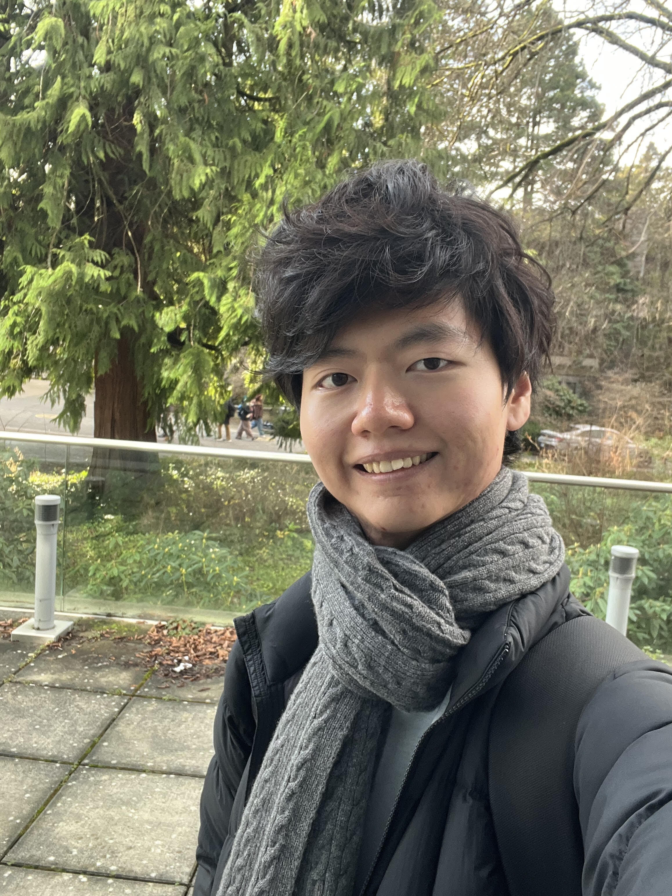
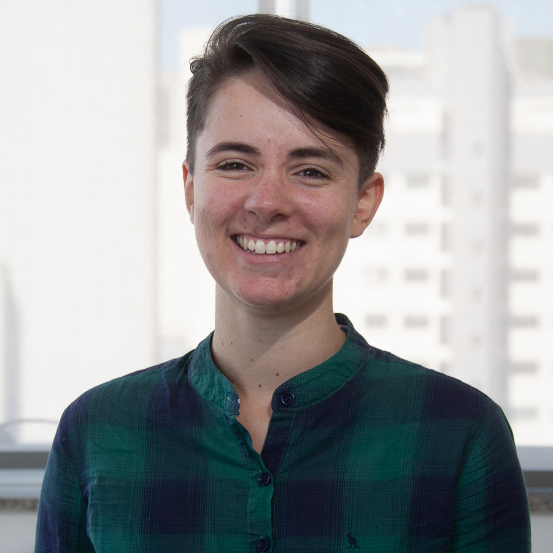
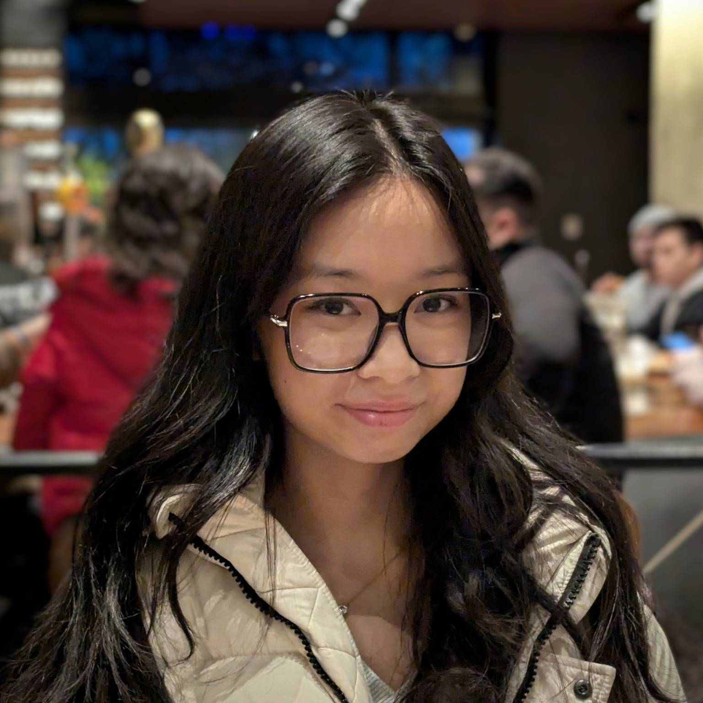
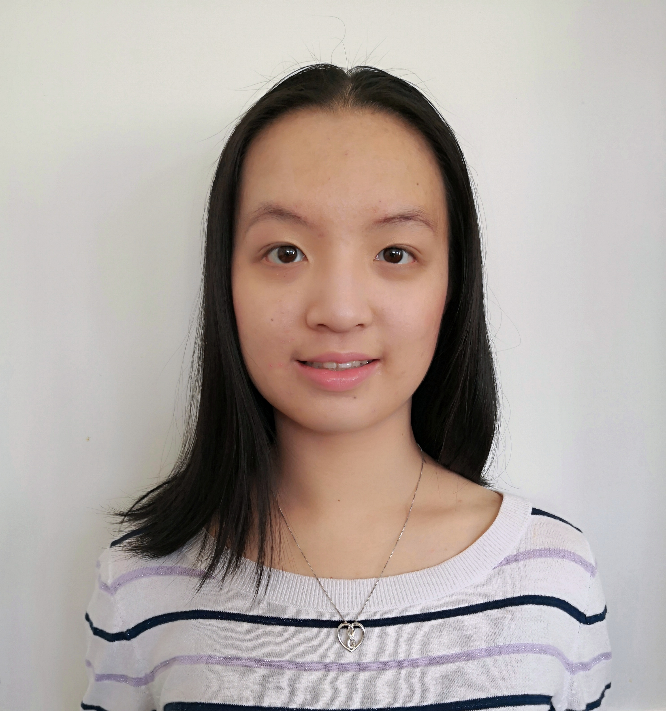

# Teaching Team

## Instructor

  

    
    

      <h3>Parsa Rajabi</h3>
      
Instructor

    

    

      
<strong>Email:</strong> <em>prajabi at cs<code>DELETEthisTEXT</code>.ubc.ca</em>

      
<strong>Office hours:</strong> Mondays, 17:20-18:00 in MCLD 2018/ICCS 255; Wednesdays, 16:50-17:30 in MCLD 2018/ICCS 255; or by appointment.

    

  

## Co-working Sessions

Instead of TA office hours, CPSC 344 offers co-working sessions where everyone is welcome to join and work together. At least one TA will be present to answer questions, help students get unstuck, and support project or assignment work. These sessions are also a good opportunity to work alongside classmates and meet people in the course.

If your group is using co-working time to discuss team process, conflict, roles, or accountability, review the [Group Work Resources](group-work-resources.md) before attending so you can bring specific questions.

  

    
Day and Time

    
Location

    
TA

    
Related Workshop Sections

  

  

    
Monday, 1-2pm

    
ICCS X360

    
Mike

    

      
D0AD0B

      
Thu 16:00-18:00; Thu 18:00-20:00

    

  

  

    
Wednesday, 2-3pm

    
ICCS X360

    
Andy

    

      
D0CD0D

      
Fri 10:00-12:00; Fri 12:00-14:00

    

  

  

    
Friday, 10-11am

    
ICCS X339

    
Jessica

    

      
D0E

      
Fri 14:00-16:00

    

  

## Workshop TA Assignments

Each workshop has one primary TA and one support TA.

  

    
Workshop

    
Time

    
Primary Workshop TA

    
Support TA

  

  

    
D0A

    
Thu 16:00-18:00

    
<strong>Mike</strong>

    
Chinmay

  

  

    
D0B

    
Thu 18:00-20:00

    
<strong>Kris</strong>

    
Mike

  

  

    
D0C

    
Fri 10:00-12:00

    
<strong>Andy</strong>

    
Rubia

  

  

    
D0D

    
Fri 12:00-14:00

    
<strong>Jessica</strong>

    
Andy

  

  

    
D0E

    
Fri 14:00-16:00

    
<strong>CC</strong>

    
Jessica

  

## Teaching Assistants

  

    
TA

    
Contact

    
Workshop Role(s)

    
About

  

  

    

      
      

        <h3>Mike Jung</h3>
        
he/him

      

    

    
<a href="mailto:bjung01@student.ubc.ca">bjung01@student.ubc.ca</a>

    

      

        D0A
        Primary TA
      

      

        D0B
        Support TA
      

    

    
Cognitive Systems student in the Arts Psychology stream. Mike has lived in South Korea, France, Greece, the U.A.E., and Canada for at least two years each.

  

  

    

      
      

        <h3>Chinmay Bhansali</h3>
        
he/him

      

    

    
<a href="mailto:chinmay.bhansali@ubc.ca">chinmay.bhansali@ubc.ca</a>

    

      

        D0A
        Support TA
      

    

    
Chinmay took CPSC 344 and 444 last academic year and is graduating from Integrated Sciences with a focus on HCI. He was TAed by Andy in 344 and Rubia in 444 which inspired him to TA 344 this year.

  

  

    

      
      

        <h3>Kris Mah</h3>
        
he/him

      

    

    
<a href="mailto:kristofer.mah@ubc.ca">kristofer.mah@ubc.ca</a>

    

      

        D0B
        Primary TA
      

    

    
Computer Science student with a minor in Commerce. Kris survived a hurricane and an earthquake to see BLACKPINK.

  

  

    

      
      

        <h3>Andy Zhao</h3>
        
he/they

      

    

    
<a href="mailto:andy.zhao@ubc.ca">andy.zhao@ubc.ca</a>

    

      

        D0C
        Primary TA
      

      

        D0D
        Support TA
      

    

    
Andy is completing an M.A.Sc. in Biomedical Engineering and enjoys making coffee drinks, cocktails, matcha, and other drinks.

  

  

    

      
      

        <h3>Rubia Guerra</h3>
        
they/them

      

    

    
<a href="mailto:rubiarg@cs.ubc.ca">rubiarg@cs.ubc.ca</a>

    

      

        D0C
        Support TA
      

    

    
Rubia is a fourth-year PhD student in the SPIN Lab researching HCI, affective haptics, and machine learning.

  

  

    

      
      

        <h3>Jessica Lescano</h3>
        
she/her

      

    

    
<a href="mailto:jlescano@student.ubc.ca">jlescano@student.ubc.ca</a>

    

      

        D0D
        Primary TA
      

      

        D0E
        Support TA
      

    

    
Jessica recently graduated with a B.Sc. in Cognitive Systems in the Psychology stream and has traveled to four countries in Asia in the last year.

  

  

    

      
      

        <h3>CC Liang</h3>
        
she/they

      

    

    
<a href="mailto:ccliang@student.ubc.ca">ccliang@student.ubc.ca</a>

    

      

        D0E
        Primary TA
      

    

    
CC is studying Cognitive Systems in the Psychology stream and has encountered Gestalt psychology four times at UBC: once in first-year Music Theory class, twice in different Psychology courses, and once in CPSC 344!

  

## Professionalism 

Students are expected to maintain a high level of professionalism in all course activities and communication with the instructor and peers. This includes proper email etiquette, respectful communication in class, and adherence to deadlines. Before sending an email, please ensure that you have included a subject line including the course code (CPSC 100), a greeting, a clear message, **your full name/student ID#** and a closing. Using AI/ChatGPT to generate emails/slack messages is **not recommended** and **such emails will be returned for revision.**

Before sending an email, make sure to review this article on [email etiquette](email-etiquette.md) and/or [How To Email Your Professor](https://personal.math.ubc.ca/~ilaba/teaching/email.html) for tips on how to effectively communicate with your instructor. **Emails that do not follow these guidelines will be returned to the sender for revision.**

> Repeated unprofessional behavior will result in grade deduction from your final grade, with **each violation resulting in a 1% deduction**. Students will be notified of possible deductions after the first official warning.
